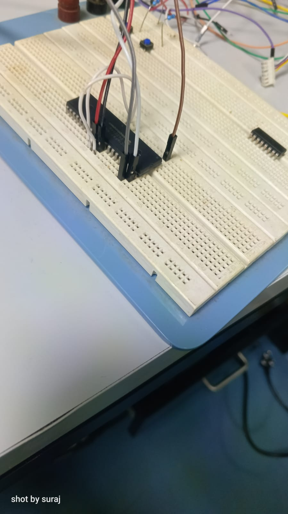

# Display of Incremental Rotary Encoder Output on GUI Using PIC 16-bit Microcontroller

An embedded systems and human-machine interface (HMI) project developed during the *Visiting Student Programme at ARIES (VSPA)* (Jan 2026). 

## 🚀 Project Overview
This project focuses on the real-time acquisition, processing, and visualization of angular position and direction data from an industrial-grade incremental optical rotary encoder. 

### Key Features:
* *Dual-Microcontroller Architecture:* Uses a modular setup where one MCU handles high-frequency Quadrature Encoder Interface (QEI) processing and a secondary MCU handles data communication via SPI.
* *Hardware Decoding:* Offloads pulse-counting and direction detection to the PIC's internal QEI peripheral to reduce CPU overhead.
* *Real-Time HMI:* A lightweight Python GUI built with Tkinter and PySerial displaying incoming telemetry at 9600 baud.
* *Actuator Simulation:* Explores closed-loop principles via simulated Unipolar and Bipolar stepper motor driver stages (ULN2003A & L293D).

---

## 🛠️ System Architecture & Data Flow
1. *Sensing:* Incremental Optical Encoder generates Phase A and Phase B quadrature signals (90° phase-shifted).
2. *Embedded Processing:* PIC 16-bit MCU decodes direction (CW/CCW) and tracks pulse metrics via hardware QEI blocks.
3. *Transmission:* Data is encapsulated into serial data frames (COUNT: <value>) and pushed across UART via a MAX232 transceiver.
4. *Visualization:* Python desktop app parses incoming buffer frames non-blocking and dynamically updates the visual interface.

---

## 💻 Repository Contents

### 1. Embedded Firmware (/firmware)
* PIC C code configuring configuration bits for high-speed crystal execution (10 MHz).
* Peripheral register setup for QEI counting modes ($\times 1, \times 2, \times 4$) and data transfer initialization.
* Low-level step excitation patterns for stepper validation logic.

### 2. Python GUI Client (/gui)
The tracking application is written in Python utilizing event-driven callbacks:
```python
import serial
import tkinter as tk

# Automated non-blocking GUI updates every 50ms
def read_serial():
    if ser.in_waiting:
        line = ser.readline().decode(errors="ignore").strip()
        if line.startswith("COUNT:"):
            value = line.split(":")[1]
            label.config(text=f"Count: {value}")
    root.after(50, read_serial)
```
### 3. Hardware Setup & Schematics (/hardware)
The hardware layer bridges mechanical rotation with digital processing, utilizing dedicated driver ICs and transistor arrays to ensure signal isolation and high-current execution handling.

#### PIC 16-bit Signal Processing Core
The system utilizes a 16-bit CPU core featuring a modified Harvard architecture, which separates program and data memory spaces to ensure high instruction throughput and predictable, deterministic execution. 

* *Hardware QEI Support:* The on-chip Quadrature Encoder Interface (QEI) module automatically processes the 90° phase-shifted Channel A and Channel B square-wave pulse trains from the incremental encoder. (start_span)This handles counting modes ($\times1, \times2, \times4$) and tracking directly in hardware, dramatically reducing CPU overhead and preventing missed steps during high-speed rotation.
* *UART Data Transceiver:* Telemetry is pushed out asynchronously over dedicated TX/RX lines using standard data frames (Start bit, 8 data bits, Stop bit). A MAX232 transceiver IC is utilized to safely convert the logic-level MCU signals to RS-232 voltage standards for reliable, low-latency PC communication.

#### Simulation & Actuator Drivers
To explore practical, closed-loop motion control principles, the project studies encoder feedback when coupled with stepper motor-driven linear actuators using ball screw and linear guide mechanisms. The math governing this linear displacement ($mm$) relative to the encoder pulse metrics is:

$$Linear\ Displacement = \left(\frac{C}{N}\right) \times L$$

Where $L$ is the ball screw lead ($mm/\text{rev}$), $N$ represents the encoder resolution ($\text{pulses}/\text{rev}$), and $C$ tracks the active encoder counts.

Two distinct driving stages were prototyped and verified):
1. *Unipolar Stepper Driver Stage:* Uses a PIC microcontroller to output a 4-step excitation sequence ($0\times01, 0\times02, 0\times04, 0\times08$) to a ULN2003A Darlington transistor array).The ULN2003A provides the necessary current amplification and isolation to drive real-time diagnostic LED indicators safely.
2. *Bipolar Stepper Driver Stage:* Features a full hardware drive implementation linking a PIC microcontroller's PORTB pins directly to an L293D dual H-bridge driver IC.The L293D handles bidirectional current control to switch magnetic polarities across the motor windings while completely isolating the MCU from destructive back-EMF spikes.

#### Repository Deliverables:
* hardware/PICloader.png: pickit that is used to load microcontroller.
* hardware/PIC16F877A.png: breadboard connectionsof  PIC microcontroller.
* hardware/Unipolar_stepper_interfacing.png: Proteus design schematic implementing the ULN2003A transistor array and verification LEDs.
* hardware/Bipolar_stepper_interfacing.png: Complete hardware circuit diagram mapping the bipolar stepper connections to mcu.
* hardware/ULN2003A.png: ULN2003A connections and testing.
  
## 🎓 Acknowledgements

I would like to express my sincere gratitude to Mr. Shobhit Yadava, Aryabhatta Research Institute of Observational Sciences (ARIES), for giving me the opportunity to carry out this short-term project under the Visiting Student Programme at ARIES (VSPA).I am deeply thankful for his constant guidance, encouragement, and insightful technical discussions, which were crucial in shaping my understanding throughout the course of this work.

I sincerely thank the faculty members of the Department of Electronics and Communication Engineering, Govind Ballabh Pant Institute of Engineering and Technology, Pauri, for their academic support and encouragement throughout my undergraduate studies. 

Finally, I express my heartfelt gratitude to my family and friends for their constant support, motivation, and understanding during this period.


